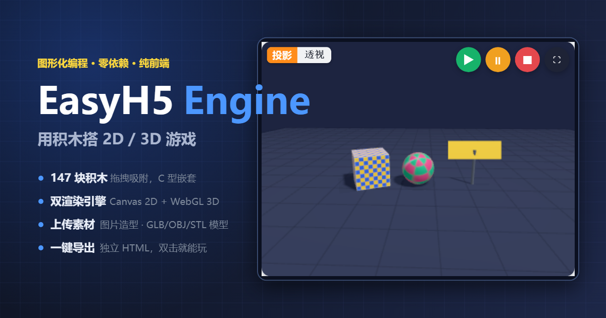

# EasyH5 Engine

> 用积木搭 2D / 3D 游戏的浏览器图形化引擎。打开即用，零依赖，纯前端。

**[▶ 在线试玩](https://gamesvibe.app/play/Klns4Mk4TVWvr8_2ECTnF)**



---

## 是什么

左边选积木、拖到中间、点运行，就能做出 2D 或 3D 的游戏和小应用。不需要装任何东西，也不需要写代码。

| 能力 | 说明 |
|---|---|
| **积木编辑器** | 11 个分类 147 块积木。拖拽自动吸附，C 型积木可层层嵌套，报告块能塞进输入槽，支持跨分类搜索 |
| **双渲染引擎** | Canvas 2D + WebGL 3D。含第一人称漫游、刚体物理、广告牌、正交投影 |
| **上传素材** | 图片当 2D 造型或 3D 贴图；GLB / GLTF / OBJ / STL 当 3D 模型 |
| **游戏手柄** | 原生积木支持，能读摇杆模拟量（轻推慢走），支持震动反馈 |
| **作品即数据** | 存成 JSON 可继续编辑；也能导出成**可离线运行的独立 HTML**，直接发给别人玩 |

引擎自身零依赖手写：没有后端、没有数据库、没有构建工具链。唯一的三方库是 three.js（已内联进产物）。

## 快速开始

### 直接玩

打开 <https://gamesvibe.app/play/Klns4Mk4TVWvr8_2ECTnF>

### 本地跑单文件版（推荐）

仓库根目录的 `EasyH5Engine.html` 是构建产物 —— three.js、引擎、编辑器全部内联在一个文件里。

**双击它就能用**，不需要服务器、不需要联网。

### 本地跑开发版

```bash
# 可以直接双击 index.html，但建议起个本地服务器
npx serve .          # 或 python -m http.server 8000
```

> `index.html` 用 `<script src>` 分别加载 `src/` 下的源码。直接双击（`file://`）也能跑，
> 但**「导出独立 HTML」会失效** —— 该功能要用 `fetch` 读取源码，而浏览器禁止 `file://` 下的 fetch。

### 重新构建单文件产物

```bash
node _tools/build.js
```

构建脚本会把 `src/` 下的源码内联进 `index.html`，产出 `EasyH5Engine.html`。
源码里**不能出现 `</script` 或 `<!--`**（会截断 HTML 解析），脚本里有断言守着这一点。

## 项目结构

```
EasyH5Engine.html      构建产物：单文件成品，双击即用
index.html             开发版外壳（配 src/ 使用）
src/
  blocks.js            积木语言定义：11 分类 / 147 块
  model.js             项目 JSON 模型、程序化造型绘制、素材库
  models.js            3D 模型解析（GLB / GLTF / OBJ / STL），零依赖
  samples.js           7 个内置示例，全部用积木真实搭建
  workspace.js         积木编辑器：拖拽吸附、C 型嵌套、输入槽、变量下拉
  runtime.js           解释器 + 运行时（async/await 执行、克隆体、广播、手柄、音频）
  render2d.js          Canvas 2D 渲染
  render3d.js          Three.js 场景 + 轻量刚体物理 + 第一人称
  app.js               编辑器主控、属性面板、导入导出、独立 HTML 编译
  engine.css           全部样式
vendor/three.min.js    three.js r160
_tools/                构建脚本 + 端到端测试
docs/                  README 用的图片
```

## 架构要点

几个值得知道的设计决定：

- **积木树 JSON** —— `{type, id, inputs:{名: 字面量 | 子积木}, fields:{名: 值}, branches:{SUBSTACK: …}, next}`。
  输入值只要是「带 `type` 的对象」就当子积木，否则当字面量。

- **解释器用 async/await，不是 generator** —— `tick()` 做**时间切片**（距上次让出超过 8ms 才 `await` 一帧），
  所以 `重复执行 1000000 次` 不会卡死界面；而 `重复执行` 每轮显式 `await frame()`，保证一帧一次迭代。

- **绿旗 = 完全复位** —— 清克隆体、恢复角色 / 变量 / 列表 / 3D 对象。比 Scratch 更「游戏引擎」，
  对新手更不容易困惑。

- **渲染坐标映射** —— 舞台坐标系原点居中、y 轴向上。2D 画布的显示尺寸完全交给 CSS，
  只设后备缓冲区并用 `ctx.setTransform()` 等比映射（这样既不变形，也不会因内联样式覆盖 CSS 而溢出裁切）。

- **独立 HTML 导出** —— 内联 three.js + 引擎源码（不含编辑器）+ 项目 JSON，产出单个可离线运行的文件。

## 测试

测试全部基于 **系统已装的 Chrome + Node 22 内置的 `WebSocket`**，不依赖 playwright，也不需要下载浏览器。

> 需要 **Node ≥ 22**（用到全局 `WebSocket`）。

```bash
node _tools/smoke.js          # 37 项：界面、2D/3D 运行、JSON 往返、全屏运行
node _tools/interact.js       # 13 项：拖拽吸附、C 型嵌套、槽位嵌套、右键菜单、拖出删除
node _tools/assets-test.js    # 30 项：上传图片当造型、3D 贴图、GLB/STL 解析、.blend 引导
node _tools/export-test.js    # 26 项：真的生成独立 HTML，再用另一个 Chrome 打开验证能跑
node _tools/features-test.js  # 43 项：手柄（注入模拟设备）、键盘/点击帽子、广告牌、正交投影、搜索、暂停
node _tools/devbuild-test.js  # 11 项：起本地服务器验证开发版（index.html + src/）
node _tools/verify-live.js    #  9 项：验证 VibeHub 线上产物可运行
```

**本地 160 项 + 线上 9 项，全部通过。**

几个测试手法值得一提：

- **像素级校验** —— 不靠肉眼量截图，而是读画布像素反算回舞台坐标做断言。
- **手柄用「替换 `navigator.getGamepads`」注入模拟设备** —— 无头环境里没法真插手柄。
- **导出物必须真的打开** —— 「生成了文件」和「文件能跑」是两件事，测试会开第二个 Chrome 加载它。
- **拖拽的目标坐标必须在拖拽过程中重新取** —— 源积木一被摘下，后面的积木会上移，事先算好的落点就偏了。

## 参与贡献

这个项目**已开启 VibeHub 共创**。你可以：

1. Fork 本仓库
2. 从最新 `main` 切出功能分支
3. 改动 `src/` 下的源码，**跑一遍上面的测试**确保没坏
4. 提交 PR

几点约定：

- 改源码后请运行 `node _tools/build.js` 重新生成 `EasyH5Engine.html`（产物已入库，便于直接取用）
- 提交前请确认 6 套本地测试全绿
- `.vibehub/project.json` 是 VibeHub 项目映射，**不要手改**

## 已知限制

- **`.blend` 不支持** —— 那是 Blender 的工程文件（内部是带指针的内存块 + 版本相关的 DNA 结构），
  不是模型交换格式，浏览器侧没有任何解析可能。遇到 `.blend` 时引擎会给出
  「Blender → 文件 → 导出 → glTF 2.0」的具体步骤。
- **`.fbx` / `.dae` / `.3ds` / `.ply` 不支持** —— 请先用 Blender 转成 `.glb`。
- **Draco 压缩的 GLB 不支持** —— 导出时请关闭压缩选项。
- **3D 物理是轻量刚体**（重力 / 弹性 / 边界反弹），不是完整物理引擎，没有旋转碰撞和关节。
- **没有自建后端** —— 纯前端，作品数据靠 JSON 文件或 VibeHub 托管。

## 许可

见 [VIBEHUB-COLLABORATION-LICENSE.md](VIBEHUB-COLLABORATION-LICENSE.md)。
